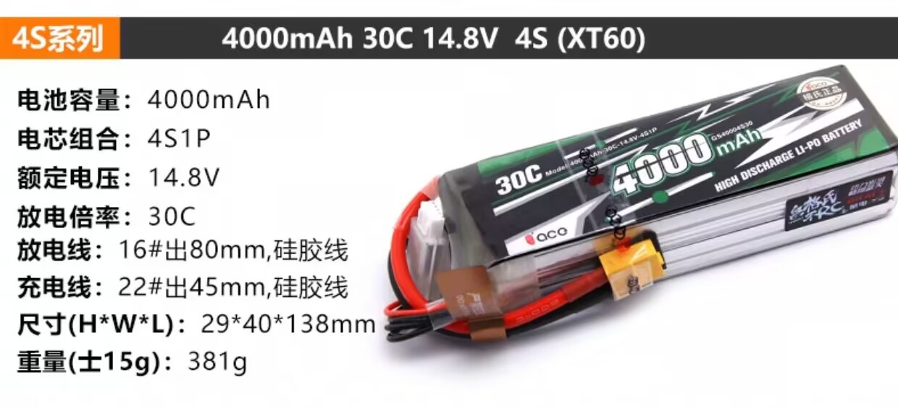
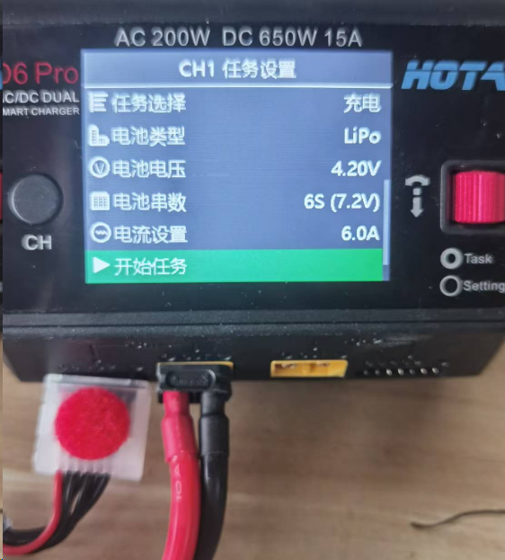
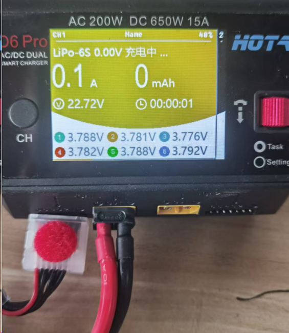

# 电池 & 充电

::: danger

请注意电池安全，过充和过放都会导致电池起火或者爆炸

:::

## 电池的常见参数

这里以格式电池为例进行介绍

#### **电池容量（4000mAh）**：

- 电池存储的电量，表示电池可以提供的总电荷量。
- 单位是毫安时（mAh），1Ah = 1000mAh。
- 容量越大，电池的续航时间越长。

#### **电芯组合（4S1P）**：

- 4S：表示4个电芯串联，电压是单个电芯的4倍。
- 1P：表示每组串联只有一个电芯，并没有并联电芯。
- 从图上可以看出是由四个电芯叠起来的所以是4S

#### **额定电压（14.8V）**：

- 表示电池的标称电压。
- **单个锂电池电芯的最低不能低于3.6V，最高不能超过4.2V，所以电池的电压在14.4V~16.8V之间，不要低于或超过这个电压**

::: warning

电池使用时请务必关注电量多少，勿低于14.4V（3.6 x 4）

:::

## 如何测量电池电压

使用BB响正面左侧插入电池测量端口，首先显示电池总电压，然后依次显示每一芯的电压

## 电池电量不足时如何充电

首先设定充电器的充电电压，串联电芯数（几s）

把电池的xt60口和检测口都插入充电器中，开始充电

按下按钮开始充电，当充满时充电器会自动停止