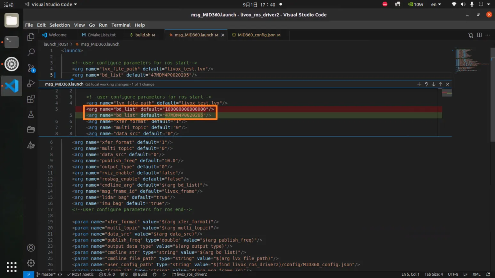
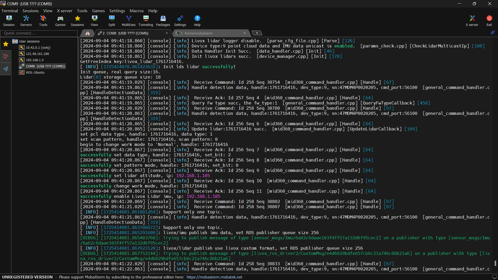
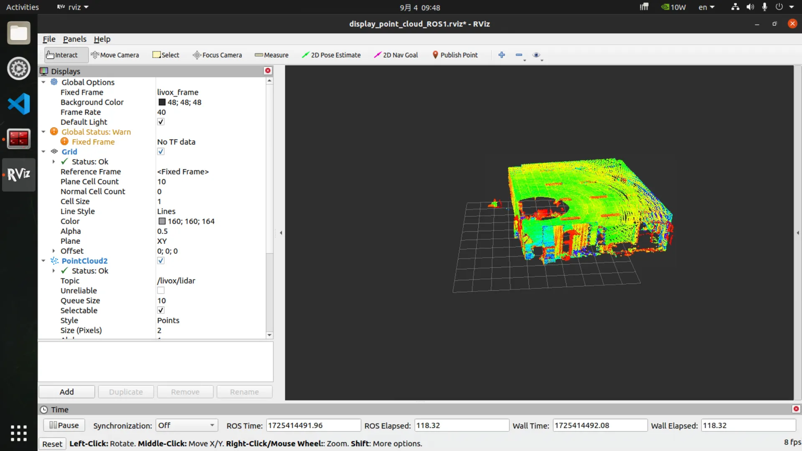
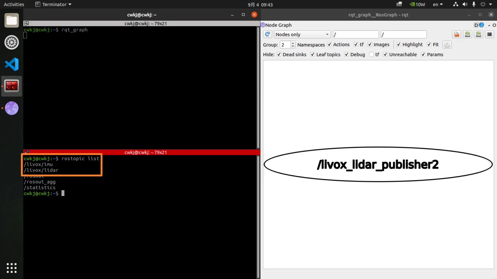

# 激光雷达 Mid360

::: tip

已购买无人机的用户此步可以跳过，无人机搭载的环境已全部配置妥当

:::

## 电脑IP设置

```sh
sudo gnome-control-center
```

将以太网 IPv4 地址设置如下图所示：


::: tip

至于为什么是192.168.1.5，请看这篇帖子：

https://github.com/Livox-SDK/livox_ros_driver2/issues/64

因为有线网口使用了1网段，若路由器也是1网段（192.168.1.0/24），请在路由器后台将设备改至其他网段，以免发生未知的错误

:::

## 参数配置

首先查看 MID-360 底座上的广播码：


我这台的广播码是`47MDM4P0020205`，记住这个编码。

找到`livox_ros_driver2`这个ROS包

```sh
roscd livox_ros_driver2
```

用`VSCode`打开这个包

```sh
code .
```

### bd_list

打开`launch_ROS1/msg_MID360.launch`，将默认的 `bd_list`修改为我们的广播码。



### host_net_info

打开`config/MID360_config.json`，将这些 IP 设置为以太网接口的 IP，也就是`192.168.1.5`


### lidar_configs

设置为 `192.168.1.1**`，最后两位是广播码（`47MDM4P0020205`）的最后两位（`05`）。对于我来说就是`192.168.1.105`。


## 启动驱动

```sh
roslaunch livox_ros_driver2 rviz_MID360.launch
```



### 点云数据

在`RViz`中可以看到点云数据



### 查看话题

```sh
rostopic list
```



## lidar_imu_init功能包使用说明

### 项目简介

在激光雷达 - 惯性里程计系统中，准确的初始状态十分关键，像激光雷达与IMU之间的时间偏移和外参变换等，通常被视为系统运行的前提条件。不同的机器有不同的参数，**在首次试飞前需要进行相应的校准工作**。

LI-Init是一个鲁棒实时的激光雷达IMU初始化工具包，可以快速地标定出三维激光雷达和IMU的时差以及外参。该工具包具有较强的鲁棒性，无需任何初值即可优化出相对准确的结果，可以满足绝大多数雷达惯性融合类算法的需求。该文章发布在了2022年的机器人顶会IROS上，项目代码开源在github: [LiDAR_IMU_Init](https://github.com/hku-mars/LiDAR_IMU_Init)


### 修改相关参数

在进行校准前，需要先修改与所用激光雷达型号对应的yaml文件参数。
编辑``~/ivox_ws/src/livox_ros_driver2/config/MID360_config.json``，主要修改以下参数：

-   ``lid_topic``:激光雷达的pointcloud话题
-   ``imu_topic``:IMU话题
-   ``cut_frame_num``：将一帧分割成子帧，提高频率。必须是正整数。
-   ``orig_odom_freq（Hz）``：原始激光雷达输入频率。对于大多数激光雷达，输入频率为 10 Hz。机械旋转激光雷达建议cut_frame_num * orig_odom_freq = 30，Livox 激光雷达建议cut_frame_num * orig_odom_freq = 50。
-   ``mean_acc_norm（m/s^2）``：IMU 静止时的加速度范数。通常，普通 IMU 为 9.805，livox 内置 IMU 为 1。
-   ``online_refine_time（second）``：使用 FAST-LIO2 进行外参优化的时间。建议优化时间为 15～30 秒左右。
-   ``filter_size_surf（meter）``：室内场景建议filter_size_surf=0.05~0.15，室外场景建议filter_size_surf=0.5。
-   ``filter_size_map（meter）``：室内场景建议filter_size_map=0.15~0.25，室外场景建议filter_size_map=0.5。

设置好正确的话题名称和参数后，你就可以直接使用自己的数据运行 LI-Init 了。

### 校准

打开终端，运行fastlio

随后在一个新的终端中输入：

```
roslaunch lidar_imu_init livox_mid360.launch
```

沿各个方向旋转并移动设备，以确保实现充分的激励。
可参考[Robust Real-time LiDAR-inertial Initialization（鲁棒且实时的雷达惯性初始化方法）](https://www.bilibili.com/video/BV1ZS4y127mW?vd_source=ff10da97fd8eec086ca6994495450b27)。

初始化和优化完成后，结果将被写入到``~/ivox_ws/src/LiDAR_IMU_Init/result/Initialization_result.txt``文件中。

### 填写参数

校准将得到一个从激光雷达（LiDAR）到惯性测量单元（IMU）的齐次变换矩阵：

```
0.997911 -0.062895 0.014785 -0.147775
0.063313 0.997551 -0.029731 -0.055362
-0.012879 0.030605 0.999449 -0.044644
0.000000 0.000000 0.000000 1.000000
```

将其填入**FAST_LIO功能包**内的```~/livox_ws/src/FAST_LIO/config/mid360.yaml```中

```
//即将修改该部分
    extrinsic_T: [ -0.011, -0.02329, 0.04412 ]
    extrinsic_R: [ 1, 0, 0,
                   0, 1, 0,
                   0, 0, 1]
```

由于得到的是一个4*4的矩阵，填入时要进行转换，如下所示：
$$
T=
\begin{pmatrix}
R & p \\
0 & 1
\end{pmatrix}=
\begin{pmatrix}
r_{11} & r_{12} & r_{13} & p_{1} \\
r_{21} & r_{22} & r_{23} & p_{2} \\
r_{31} & r_{32} & r_{33} & p_{3} \\
0 & 0 & 0 & 1
\end{pmatrix}
$$
最后一列是平移信息，它是一个 [1, 3] 的数组，而旋转矩阵是一个 [3×3] 的数组，转换后填入```~/livox_ws/src/FAST_LIO/config/mid360.yaml```：

```
//修改后
extrinsic_T：[-0.147775, -0.055362, -0.044644]
extrinsic_R：[ 0.997911, -0.062895, 0.014785,
0.063313, 0.997551, -0.029731,
-0.012879, 0.030605, 0.999449]
```
