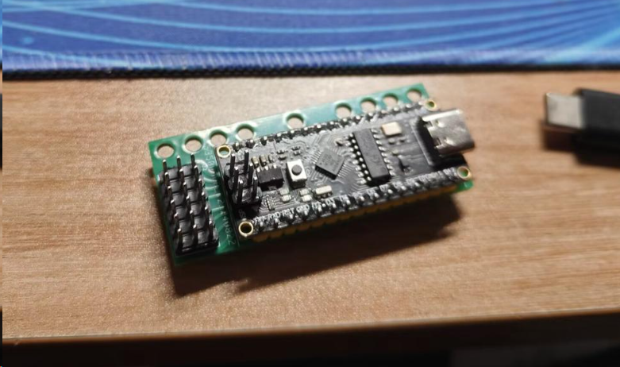

# 舵机投放方案

## 白嫖嘉立创打板

### 下载工程文件

<a href="/ProProject_NANO转舵机控制板.epro" download>点击下载epro工程文件</a>

### 下载嘉立创EDA专业版

https://pro.lceda.cn/

### 导入专业版


选择刚刚解压的epro文件

### 下单


点击下单嘉立创，在嘉立创领劵可以免费打板

## 焊接烧录与连线

### 焊接

焊上单片机和排针，注意方向，是直接盖在上面的文字上面



板子使用arduino none，购买2.54mm间距3x6P（只用三个买3x3P也可）

### 烧录与接线

在ubuntu上安装arduino和依赖，烧录`servo.ino`到单片机中

<a href="/servo.ino" download>点击下载servo.ino文件</a>

接入舵机线，靠近单片机的一侧是信号线（黄色）


## 启动指令

安装依赖

```
sudo apt update
sudo apt install ros-noetic-rosserial
```

使用数据线连接电脑与单片机

启动下面三个指令

```
roscore
```

```
rosrun rosserial_python serial_node.py _port:=/dev/ttyUSB0 _baud:=57600
```

```
python servo_test.py
```

servo_test.py程序如下，输入`0 180`，对应第1pin转到180；输入`a 180`，使三个舵机全转到180；输入q退出

```
      
#!/usr/bin/env python

import rospy
from geometry_msgs.msg import Point

def main():
    rospy.init_node('interactive_point_publisher')
    pub = rospy.Publisher('/arduino_ros', Point, queue_size=10)

    point = Point()
    
    while not rospy.is_shutdown():
        try:
            user_input = input("Enter coordinate (e.g., '0 180' or 'q' to quit): ")
            
            if user_input.lower() == 'q':
                print("Quitting...")
                break
            
            axis, value = user_input.split()
            value = float(value)
            
            if axis.lower() == '0':
                point.x = value
            elif axis.lower() == '1':
                point.y = value
            elif axis.lower() == '2':
                point.z = value
            elif axis.lower() == 'a':
                point.x = value
                point.y = value
                point.z = value
            else:
                print("Invalid axis. Please enter '0', '1', '2' or 'a'.")
                continue
            
            pub.publish(point)
            rospy.loginfo(f"Published: 0={point.x}, 1={point.y}, 2={point.z}")
        
        except ValueError:
            print("Invalid input. Please enter in the format 'axis value'.")
        except rospy.ROSInterruptException:
            break

if __name__ == '__main__':
    main()
```

